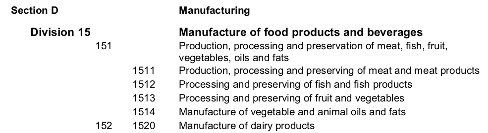

# Relationships between observations

We have seen how entities may be related to one another. Manager may work at firms, firms may be run by managers. But often, observations about entities are not independent, either.

Take, for example, this list of temperature readings from various sensors. The observations in this table are _measurements_. 

{icon: database}
B> NASA sensor data here
B> in simple table

Clearly, Morocco is warmer than Iceland. It also seems that, for each region, July is warmer than December. When modeling this data, we want to allow for the fact that measurements on the same sensor, as well as measurement at the same time _belong together_. 

## Grouping observations

The most general relationship is __grouping__. We want to group all measurements of the same sensor together. Then we can analyze measurements _within the group_ (say, variation in temperature over time) and measurements _across groups_ (say, variation in average temperature across sensors). This latter would typically involve some statistical aggregation, as a group can have multiple observations.

If we decide to group observations for analysis, it is important to define the right groups. First, each observation should belong to a group. You have to decide what to do with that sensor in Antarctica (or on the Moon) if you set out to analyze temperatures by country. Second, no observation can belong to more than one group. This we can enforce easily by referring to groups as a variable for each observation using a simple key, such as `sensor_id` or `country_code` above. Third, the level of grouping should be tailored to our analysis. If we are writing a report on broad temperature deviations across countries, the right grouping is probably countries. If we are working on a new algorithm to correct sensor measurement error, the right grouping is probably sensors.

A> # Statistical box?
A> Within-group variation relative to mean
A> Across-group variation of means

## Hierarchical grouping

Groups may themselves be related in hierarchies. The best known hierarchy is that of spatial administrative units: cities, states and countries. In our sensor data, each measurement belongs to one sensor. Then each sensor belongs to a country. (It does not belong to a city because they are typically outside city boundaries.) 

__Statistical classifications__ also tend be hierarchical. Statisticians love hierarchies! They divide economic activity into broad sectors like manufacturing and construction. Within manufacturing, you may work in "food products and beverages," or "textiles." Within food products, you may be producing dairy or meat. And so forth.

A> # International family of classifications
A> The [_international family of classifications_](https://unstats.un.org/unsd/classifications/Family/ListByDomain#2) is maintained by the Statistics Division of the UN. There is a classification of family status ("married", "single" doesn't cut it), a classification of fish species, a classification of tourist activities ("stag parties" not being one of them), even a classification of classifications! This is a useful website if you want to nerd out, or if you need to convert between different classifications.

If you encounter hierarchical groups in your data, make sure you capture all the levels you may possibly want to use in the future. It is a mistake to aggregate up the data to some easy level (broad industries, say). You never know what analysis you want to do later.

If you do aggregate up, make sure to respect the hierarchy and only group observations that do belong together. Often, but not always, the hierarchy is reflected in the numerical identifier. For example, Division 15 in the International Standard Industrial Classification of All Economic Activities
(ISIC) stands for food and beverage manufacturing. The three-digit code 151 stands for "Production, processing and preservation of meat, fish, fruit, vegetables, oils and fats," and the four-digit code 1511 stands for meat production. You can walk up the hierarchy by simply omitting the less significant digits.
 

Note that classification codes often write out the leading zero. Reading in such codes as numeric and losing the leading zero has confused me quite a number of times. (Also see Chapter XX on choosing good numerical keys.)

{icon: database}
B> 
B> [ISIC Revision 3.1.](https://unstats.un.org/unsd/statcom/doc02/isic.pdf)

## Time

Another natural relationship among observations is temporal: some may be earlier than others, some may be later, some may happen at the same time. The time stamps in EE above reflect the time at which the measurement was taken.

Time can be recorded as an instant in time, such as the __time stamp__ above. This is the easier case, as the relationship between any two instants is simple. (Notwithstanding complications with time zones. We are also ignoring relativity theory for temporal data analysis.) When observation A has a smaller number in its time stamp than observation B, it simply happened earlier. 

Having time stamps, you can create natural hierarchical groups by grouping observations into days, months, years, etc. There is more to time stamps, though. You know _exactly_ how time passed between events A and B, and you can set your statistical model to account for that. Generally, you will need _time series_ methods such as autoregression or survival analysis.

A>
A> A figure of a timeline
A>

Your time field may come at various __frequencies__: yearly, monthly, daily, or even by the millisecond. It is important to keep frequencies consistent in your dataset. You also want to pick a frequency suitable for your analysis. If you are studying the effect of temperature on crop yield and only measure yield data annually, you will want to aggregate up your temperatures also to the year.

What if your observation represents an __interval in time__? A manager has served at the company between times T1 and T2. The company has earned a million dollars between January 1 and December 31. Such intervals are also called __time spells__.

This is where things get tricky! Did you know that there are 13 different relations between time intervals? A may _take place before_ B, they may _overlap_, it may _finish_ B, and so forth. Allen's interval algebra captures these relations formally (see [box](#allen-algebra)). 

{icon: wikipedia-w, #allen-algebra}
B> ## [Allen's interval algebra](https://en.wikipedia.org/wiki/Allen%27s_interval_algebra)
{caption: X overlaps with Y}

This is confusing, but you are unlikely to need all these possible relations. You will need to measure which interval is earlier (ranking the start time of intervals, for example), and to measure overlap. For example, have Margaret and Dan served at the firm at the same time? This is a question of __overlap__. Can Margaret be responsible for hiring Dan? Has she arrived earlier than him? This is a question of __precedence__.

A typical solution to get rid of time spells is _temporal sampling_: take a number of time _instances_ and select the observations that were valid in that instance. Take all the managers who were at the firm on June 21, 1997, for example. This reduces the time dimension to time stamps, which are easier to study. But they may increase your dataset as a long spell (say, January 1, 1991 to December 31, 2017) will get into many of your temporal samples.

T> # Why June 21?
T> You may be tempted to sample your data at dates like January 1 or December 31. As firms and data entry users prefer to report round dates, this is potentially dangerous. SolidWork and Co. may report all its changes on December 31, Hungover Ltd. may hold their reporting until January 1. If you sample on December 31, you get the correct data for SoldWork Co, but last year's data for Hungorver Ltd! To avoid such bunching around round dates, we at CEU MicroData picked day of the year that is in the middle of the year and is not round: June 21. This also happens to be midsummer.

A practical consideration is __date and time format__. Years, months, days, hours, minutes, seconds and milliseconds can written a myriad ways, and you will encounter each of these in data in the wild. Luckily, there is an ISO standard for dates and times: ISO 8601. When seeing date and time related fields, your _first_ task is always to convert it to ISO 8601.

{icon: wikipedia-w}
B> ## ISO 8601
B> `2018-09-16T12:10Z`

## Space

{icon: wikipedia-w}
B> https://en.wikipedia.org/wiki/Spatial_relation

