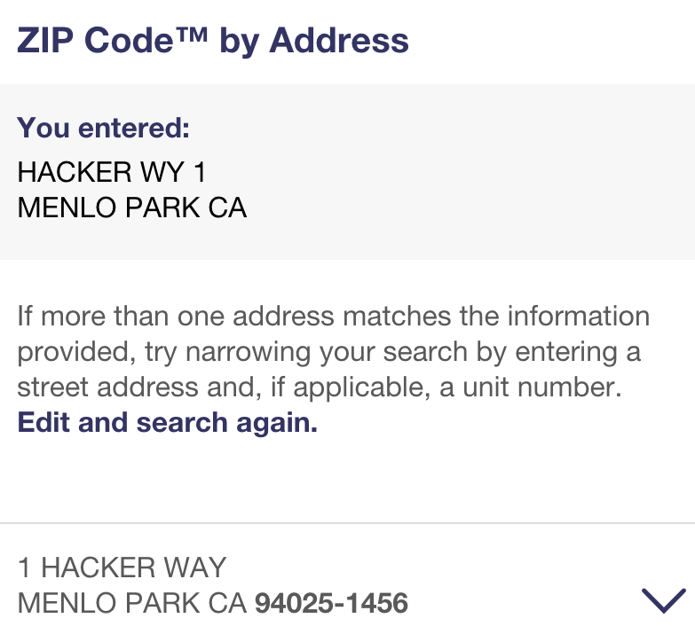

# Choose great keys
We have seen in Chapter XX that _keys_ are what you use to refer to entities in other tables. A _primary key_ is the unique identifier of each observation in your table, a _foreign key_ is pointing to other entities in another table. For example, the tables below show a many-to-many relation between firms and managers. The `firm_id` is the primary key of the `firm` table, whereas `person_id` is the primary key of the `person` table. Both are foreign keys in the `manage` table, which lists the time spells during which manager with `person_id` manages a particular firm with `firm_id`. (Keys are also called _index_ and _id_.)

A> Example of three tables, referring to one another with foreign keys. `firm` - `manage` - `person`

But how do these keys look in real life? Are they consecutively numbering rows from 1? Can we use names of firms and people as keys? Should we use cryptographic hash functions to generate [universally unique identifiers](https://en.wikipedia.org/wiki/Universally_unique_identifier)? Often you will have this decided for you with keys already given in the data store in which you are loading your data. This chapter is about the trade-offs when you get to make the choice yourself.

## Names are not unique

Most importantly, keys should be _unique_, that is, no two different observations should receive the same key. This sounds obvious, but your design can make this requirement harder or easier to satisfy. Suppose you decide to refer to users by their last name (an obviously silly idea). After the second `smith` and `jones`, you will have to change your system. Then you decide to add first names. You are safe until the second `john_smith` or `charles_jones`. You'll end up with `john_smith_02`, which is just plain ugly. (And what if there are more than 99 John Smiths's in your data?) 

If you think you would never commit such silly mistakes, read Patrick McKenzie's [list of 40 falsehoods](https://www.kalzumeus.com/2010/06/17/falsehoods-programmers-believe-about-names/) programmers often assume about names. I come from a country which uses the Eastern name order, uses many accented letters, and where wives' married names often do not include their first names (as in "Szabó Jánosné" ~ "Mrs John Smith"). I've encountered people with only one name. How hard it is for them to enter their name into any web app or database?

It gets worth with companies and organizations. It is next to impossible to use their correct name more than once. The municipal government of the Budapest district where my university is located is officially called "Belváros-Lipótváros Budapest Főváros V. kerület Polgármesteri Hivatal." How often do you think it is spelled right in databases? Moreover, there are 37 elementary schools in Hungary whose official name is simply "elementary school."

D> better, more international examples?

No, names are not unique, and are a terrible choice for unique keys. This is why most web apps and databases opt for a user chosen alphanumeric userid, an email address, or a computer-generated numeric identifier.

## Verbose keys

Follow these four tips to create useful keys.

1. _If there is a well established identifier for the entity you are describing, use that._ People have Social Security Numbers, firms have Employer Identification Numbers, regions have NUTS or FIPS codes, countries have ISO 3166 codes. Do not invent your own key unless you absolutely have to. 
2. _Your key should be human readable, not just machine readable._ A sequentially increasing integer ID is not very helpful. Nor is an SHA1 has has such `dc6e5923f968db05aee116d94d1792385a9fcca8`. Depending on context, combining 2-3 letters and 8-10 digits works best.
3. _Keys for one type of entity should be easily distinguishable from keys for another type of entity._ When you look at a key, you should immediately see what entity it refers to. Everyone knows `08540` is a ZIP-code and `770-10-2831` is a Social Security Number. 
4. _Use hyphens or other punctuation to denote hierarchy in keys._ The ZIP+4 code `53075-1108` clearly delineates the 5-digit ZIP code from the 4-digit routing number. URLs are the best example of hierarchical keys: `leanpub.com/dataarchitecture` refers to this particular book, but you can use this structure to generate keys for other LeanPub books.

A> ## Example keys for firms and people
A> `F-DE-01234567` is a German firm. `F-HU-12345678` is a Hungarian firm. (Note the use of 2-letter ISO-3166 country codes.) `P-1234567890` is a person.

Depending on the type of entity you are modeling, look out for these existing unique identifiers.

companies
: tax identifier, Employer Identification Number (EIN), EU VAT identifier, Open Corporates ID

individuals
: Social Security Number, email address

regions
: FIPS, NUTS, ZIP-code (although a ZIP code does not refer to an _area_)

countries
: ISO 3166 standard, 2-letter, 3-letter or numeric identifier

## Hierarchical keys

## Entity Resolution

How do you get from "Charles Jones" to `P-1234567890`? In practically all of your data, you will face the question whether _this_ Charles Jones is the same as _that_ Charles Jones? Take the following entries from the Open Corporates database.

{icon: database}
B> similar names from OpenCorporates

It seems that rows 1 and 2 refer to the same person, whereas row 3 refers to a different person. How do we know? More importantly, how do we make the computer know this?

This problem is known as __entity resolution__ (ER), record linkage, deduplication, or fuzzy matching. (It is different from _named entity recognition_, where you have to recognize entities in flow text.) It is as complicated as it looks. Names and other fields are misspelled, so if you are too strict, you fail to link two related observations. If you are too fuzzy, you mistakenly link unrelated observations.

D> I feel like "variable" is not the right term. Nothing varies. Maybe stick to "field" throughout? How about "record" vs "observation"?

The first guiding principle of entity resolution is to embrace the imperfections. There is no perfect method, you are just balancing two types of error. _False positives_ occur when you link two observations that, in reality, refer to two different entities. _False negatives_ occur when you fail to link two observations that, in reality, represent the same entity. You can always decrease one type of error at the expense of the other by selecting a more or less stringent matching method.

The second guiding principle is to appreciate the computational complexity. If you are unsure about your data, you have to compare every observation with every other, making `N(N-1)/2`$ comparisons in a dataset with `N`$ observations. (See box on why it is sufficient to make _pairwise_ comparisons.) In a large dataset this becomes prohibitively many comparisons. For example, if you want to deduplicate users from a dataset with 100,000 observations (a small dataset), you have to make 10 _billion_ comparisons. Throughout the ER process, you should be looking for ways to reduce the number of necessary comparisons.

A> ## Methods aside
A> An entity resolution defines groups of observations that belong to the same entity: `e=\{o_1,o_2,o_3,...\}`$. Maybe surprisingly, it is sufficient to define when a _pair of observations_ denote the same entity, when `e(o_1)=e(o_2)`$. Because equality is _transitive_, we can propagate the pairwise relation to the entire dataset: if `e(o_1)=e(o_2)`$ and `e(o_2)=e(o_3)`$ then `e(o_1)=e(o_3)`$ and `e=\{o_1,o_2,o_3\}`$.
A>
A> With fuzzy matching, we cannot tell precisely whether the entities behind two observations are _equal_. We can just calculate a _distance_ between the two observations, `d(o_1,o_2)\ge 0`$. The problem with this is that distances are not transitive: if `o_1`$ and `o_2`$ are "very close" and so are `o_2`$ and `o_3`$, that does not make `o_1`$ and `o_3`$ "very close." We have the _triangle inequality_, `d(o_1,o_3)\le d(o_1,o_2)+d(o_2,o_3)`$, but this is much weaker than transitivity. 
A>
A> The goal of fuzzy matching is to transform a distance into an equality relation. For example, `e(o_1)=e(o_2)`$ whenever `d(o_1,o_2)\le D`$ is a simple formula to use. But beware of being too fuzzy: when `D`$ is too big, you can end up linking observations that are very different. For example, if you allow for a _Levenshtein distance_ of 2 between a pair of words, you will find that
`book` `=` `back` `=` `hack` `=` `hacker`. I bet you didn't believe `book=hacker`.

D> Style question for editor: when do I use "you" vs "we"? How do I mix?

The three steps to efficient ER are to Normalize, Merge, and Propagate.

1. First you _normalize_ your data by eliminating typos, alternative spellings, to bring the data to a more structured, more comparable format. For example, a name "Dr Charles Jones III" may be normalized to "jones, charles." Normalization can give you a lot of efficiency because your comparisons in the next step will be much easier. However, this is also where you can loose the most information if you are over-normalizing. If there is a canonical way to represent the information in your observations, use that. For example, the US Postal Services standardizes US addresses (see figure) and [provides an API](https://www.usps.com/business/web-tools-apis/address-information-api.htm) to do that.
2. Then you _merge_ pairs of observations which are close enough according to your metric. The metric can allow for typos, such as a Levenshtein distance. It can rely on multiple fields such as name, address, phone number, date of birth. You can assign weights to each of these fields: matching on phone number may carry a large weight than matching on name. You can also opt for a _decision tree_: only check the date of birth and phone number for very common names, for example. 

To minimize the number of comparisons, you typically only evaluate _potential matches_. This is where normalization can be helpful, as you only need to compare observations with normalized names of "jones, charles," for example.

3. _Propagate._ 

- Distance metrics
- Training your ER with ML